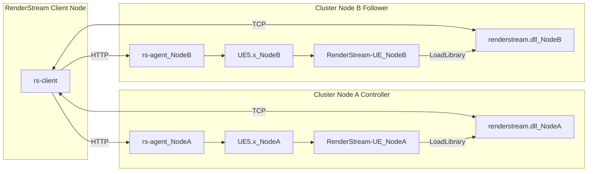

# RenderStream

- [RenderStream](#renderstream)
  - [Concept](#concept)
  - [Progress](#progress)
    - [common](#common)
    - [rs-dll (RenderStream DLL)](#rs-dll-renderstream-dll)
    - [rs-agent](#rs-agent)
      - [test 🗑️](#test-️)
    - [rs-client](#rs-client)

## Concept

## Progress

|||
|---|---|
| 🚧 | WIP |
| ✅ | Done |
| 🔄 | Refactoring |
| 🗑️ | Scheduled for deletion |

### common

- ✅ **`d3renderstream.h`**
- 🔄 **`d3renderstream.hpp`**

### rs-dll (RenderStream DLL)

- ✅ **`logging.h`** / **`logging.cpp`**
- 🔄 **`streams.h`** / **`streams.cpp`**
- 🔄 **`gpu.h`** / **`gpu.cpp`**
- 🔄 **`sender.h`** / **`sender.cpp`**
- 🔄 **`link.h`** / **`link.cpp`**
- 🚧 **`renderstream.cpp`**

### rs-agent

- 🔄 **`http_server.h`** / **`http_server.cpp`**
- 🔄 **`lan_announcer.h`** / **`lan_announcer.cpp`**
- 🔄 **`pipe_server.h`** / **`pipe_server.cpp`**
- 🔄 **`process_manager.h`** / **`process_manager.cpp`**

#### test 🗑️

### rs-client
