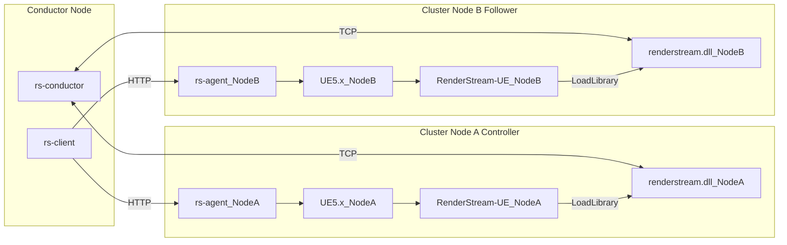

# RenderStream

- [RenderStream](#renderstream)
  - [Concept](#concept)

## Concept

```mermaid
flowchart LR
    subgraph Conductor Node
        rs-conductor
        rs-client
    end

    subgraph Cluster Node A Controller
        rs-agent_NodeA
        UE5.x_NodeA
        RenderStream-UE_NodeA
        renderstream.dll_NodeA
    end

    subgraph Cluster Node B Follower
        rs-agent_NodeB
        UE5.x_NodeB
        RenderStream-UE_NodeB
        renderstream.dll_NodeB
    end

rs-client -- HTTP --> rs-agent_NodeA
rs-conductor <-- TCP --> renderstream.dll_NodeA
rs-client -- HTTP --> rs-agent_NodeB
rs-conductor <-- TCP --> renderstream.dll_NodeB

rs-agent_NodeA --> UE5.x_NodeA
UE5.x_NodeA --> RenderStream-UE_NodeA
RenderStream-UE_NodeA -- LoadLibrary --> renderstream.dll_NodeA

rs-agent_NodeB --> UE5.x_NodeB
UE5.x_NodeB --> RenderStream-UE_NodeB
RenderStream-UE_NodeB -- LoadLibrary --> renderstream.dll_NodeB
```
